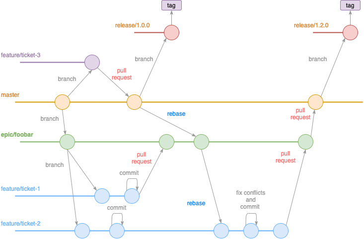
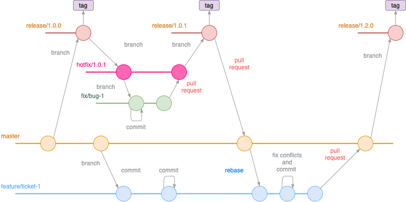
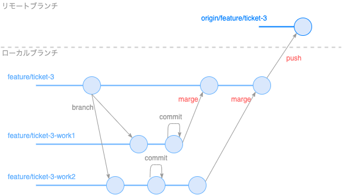

## 開発フロー
**GitHubのPullRequestを用いたGitHub flowで行う**

### 開発フロー概要
1. [ 設計者/不具合報告者 ] GitHubに Issue(チケット) を起票する。
 - Labels には、[enhancement] or [bug]を指定する。
1. [ PM/PL ] Issue(チケット) を開発者にアサイン(Assigneesに開発者を指定)する。
1. [ 開発者 ] Issue(チケット) の Labels に [in progress] を付与する。
1. [ 開発者 ] 作業対象のマスターソース(masterブランチ)をpullする。
1. [ 開発者 ] 作業用のローカルブランチを作成する。
1. [ 開発者 ] 機能追加、不具合修正等々の開発作業を実施する。
1. [ 開発者 ] 静的解析とテストを実施する。
1. [ 開発者 ] 作業中の変更は、内容の小さな単位で commit を心がける。
1. [ 開発者 ] 開発が完了したらローカルブランチをリモートブランチへ push する。
1. [ 開発者 ] Pull Request を作成し、Assigneesにレビューアーを指定する。
  ※作業中のコードレビューの場合は Titleに[WIP]を付与する。
1. [ レビューアー ] Pull Request の内容をレビューする。
1. [ レビューアー ] レビュー結果を判断し、必要ならば開発者にフィードバックする。
1. [ レビューアー ] レビューの結果、問題がない場合は marge する。
1. [ レビューアー ] リモートブランチを削除する。
1. [ レビューアー ] GitHub の Issue(チケット) をクローズする。
1. [ 開発者 ] 起票者に Issue(チケット) の完了を報告(Assigneesに起票者を指定)する。
1. [ 設計者/不具合報告者 ] 対応内容を確認とテストする。
1. [ 設計者/不具合報告者 ] 対応内容に問題があった場合は、開発者へ差し戻す。アサイン(Assigneesに開発者を指定)する。
1. [ 開発者 ] Issue(チケット) をリオープン、Pull Requestから 削除したリモートブランチを復活(Restore branch)させて、開発を行う。

### シーケンス図


### ブランチの運用ルール
**GitHub Flow モデル を採用する。**

- GitHub Flow – Scott Chacon http://scottchacon.com/2011/08/31/github-flow.html
- GitHub Flow (Japanese translation) https://gist.github.com/Gab-km/3705015
- プルリクエスト https://www.atlassian.com/ja/git/workflows#!pull-request

開発者はマスターブランチからブランチを作成してフィーチャー(機能)の実装を行います。
開発中に他者が実装したフィーチャーを取り込む場合はリベースします。
開発が完了したらプルリクエストでレビュー/マージします。


プルリクエスト(プルリク)は、最も単純に言えば、開発者がフィーチャー開発作業の完了をチームメンバーに通知するメカニズムです。フィーチャー ブランチの準備ができた時点で、開発者は GitHub アカウントを使いプルリクエストを送信します。これにより、関係者全員はそのコードをレビューし、マスターブランチにマージする必要があることが知らされます。

> octocat/Spoon-Knife https://github.com/octocat/Spoon-Knife は、GitHubがデモ用に公開しているリポジトリです。各Gitコマンドやプルリクなど試してみてください。

開発するフィーチャー(機能)の規模が大きくなる場合、マスターからトピックブランチを作り各フィーチャーはそこにマージするようにします。
複数のリリースを平行開発する場合や運用保守時などに使用します。



提供中のリリースに対して急いでパッチを当てて修正する場合には、メンテナンスブランチ(hotfix ブランチ)を作成して開発を行います。



### ブランチについて
開発はチケット(Issues)単位に行います。
チケット(Issues)がアサインされたら、ローカルブランチの作成を行ってください。

ローカルのmasterブランチから開発用のローカルブランチを作成します。

**ブランチネーミングルール**

- プレフィックスには、必ず feature/ を付与 ※SourceTree で見やすくなります。
- タイトル
 - 機能[enhancement] の場合、説明的な名前を付与
  - ```feature/modify_connection_defines```
 - バグ[bug] : チケット(Issues)の番号を付与
  - ```feature/issues-239```

開発中はこのローカルブランチに対してコミットを行います。

### コミットコメント記入ルール
```
1行目　　　: コミットでの変更内容の要約
2行目　　　: 空行
3行目以降　: 変更した理由
〜
```

### プッシュ
ローカルブランチで作成したブランチを共有したい場合は、明示的にリモートへプッシュする必要があります。

プッシュしない限りリモートリポジトリに影響を与えることなく、ローカルブランチを自由に作成や変更をすることができます。
プッシュする前にコミットの履歴を書き換えるなどが可能です。

#### ローカルブランチの作成とマージ
開発中に、チケット単位で作成したローカルブランチから、ブランチを作成して開発しても問題ありません。

ワークブランチで開発〜コミットし、ローカールブランチへマージ。マージ後コミットをまとめて、リモートブランチへプッシュします。



### プルリクエスト
プルリクエストとは簡単に言うと、開発者のローカルリポジトリでの変更を他の開発者に通知する機能です。プルリクエストは次のような機能を提供します。

機能追加や改修など、作業内容をレビュー・マージ担当者やその他関係者に通知します。
ソースコードの変更箇所をわかりやすく表示します。
ソースコードに関するコミュニケーションの場を提供します。

*ルール*

- タイトル
 - 変更の内容が他の人にも伝わるように1行でまとめる。
 - バグ対応の場合、チケット(Issues)のタイトルと同じでも構わない。
 - 開発途中のレビューのための場合は、[WIP]を先頭に付与する。
- 詳細
 - 対応した チケット(Issues)のタイトルを番号付きで付与する。(コピペ)
 - 変更した内容を箇条書きで記述

```
- メイン画面実装 #3
- 一覧の実装
- 再生機能の追加
```

- Assignees
 - レビューアーを指定する。


### コードレビュー
Pull Request の Files changed でレビューします。


### マージ
Pull Request のレビューが完了したらマージを行います。

マージが可能であれば、[ Marge pull request ] を選択が可能です。

> コンフリクトが発生している場合は、マージが行えません。Pull Request を行った人が、開発ブランチをmasterとリベースしコンフリクトを解消させて、再度 Push します。 

コメントには この Pull request で解決した Issueのタイトルに fixと#fixタグを付与したものを記述します。
例)

```
メイン画面実装 fix #3
```
・fix #[issue number] で、該当のissue がクローズされます。

> コミットログでの課題の操作 http://www.backlog.jp/help/usersguide/git/userguide1400.html


マージが完了したら、開発ブランチの削除を行います。
いつでもリストアできるので、気にせずに消しましょう!!!


#### (参考)
- 開発フロー研修 @ Wantedly - Qiita http://qiita.com/awakia/items/c571e93e96a1ec28044f#_reference-fc25210dd2295431b965
- GitHub「完璧なプルリクの書き方を教えるぜ」 - Qiita http://qiita.com/umanoda/items/93aec41213f8e3ce14c8
- GitHub flowを用いた開発フロー - Qiita http://qiita.com/ryotakodaira/items/e860396ae44942dcca5e
- 開発者のタスク管理をGitHubで行ったらうまくいった話 ｜ Developers.IO http://dev.classmethod.jp/tool/git/github-issue-driven-dev/


- Do Not Merge WIP for GitHub - Chrome ウェブストア https://chrome.google.com/webstore/detail/do-not-merge-wip-for-gith/nimelepbpejjlbmoobocpfnjhihnpked

- GitHub Flow – Scott Chacon http://scottchacon.com/2011/08/31/github-flow.html
- GitHub Flow (Japanese translation) https://gist.github.com/Gab-km/3705015
- プルリクエスト https://www.atlassian.com/ja/git/workflows#!pull-request

- ブランチとは | サルでもわかるGit入門 http://www.backlog.jp/git-guide/stepup/stepup1_1.html
- プルリクエストとは？ | サルでもわかるGit入門 http://www.backlog.jp/git-guide/pull-request/pull-request1_1.html

- Git - 初めてコードレビューされる人のためのpull requestとcommitの作り方 - Qiita http://qiita.com/reikubonaga/items/e3b3b19c14d4ef4efb95
- Pull Request のフォーマットを決めるとレビューの効率が3倍よくなる :: Crocos Engineering Blog http://engineering.crocos.jp/post/98455177675/pull-request-%E3%81%AE%E3%83%95%E3%82%A9%E3%83%BC%E3%83%9E%E3%83%83%E3%83%88%E3%82%92%E6%B1%BA%E3%82%81%E3%82%8B%E3%81%A8%E3%83%AC%E3%83%93%E3%83%A5%E3%83%BC%E3%81%AE%E5%8A%B9%E7%8E%87%E3%81%8C3%E5%80%8D%E3%82%88%E3%81%8F%E3%81%AA%E3%82%8B

**マージ後の削除されていないブランチ一覧抽出するコマンド**
```
git branch -r --list --no-merged | grep -v '*' | xargs -Ibranch git log -1 --pretty=format:"|branch|%an|%ad|%s|" --date=short branch
```
※master等マージ先をカレントブランチにして実行する。


### タグ
master から適宜タグを作成します。お客様へのベータリリース、本番リリースなど。

- ネーミングルール
- バージョン
- リリース番号等
- 任意のテキスト

例)

- プロダクトリリース

 ```1.0.0_r1```

- ベータリリース等

 ```
1.0.0_alpha
1.0.0_beta
1.0.0_beta2
1.0.0_beta3_user_demo
1.0.0_rc1
 ```


### リリース
GitHubのReleasesで作成することが可能です。
リリースはタグと一緒に作成します。

タイトルには、バージョンとリリース番号等を記述します。
詳細にリリースノートを記述
