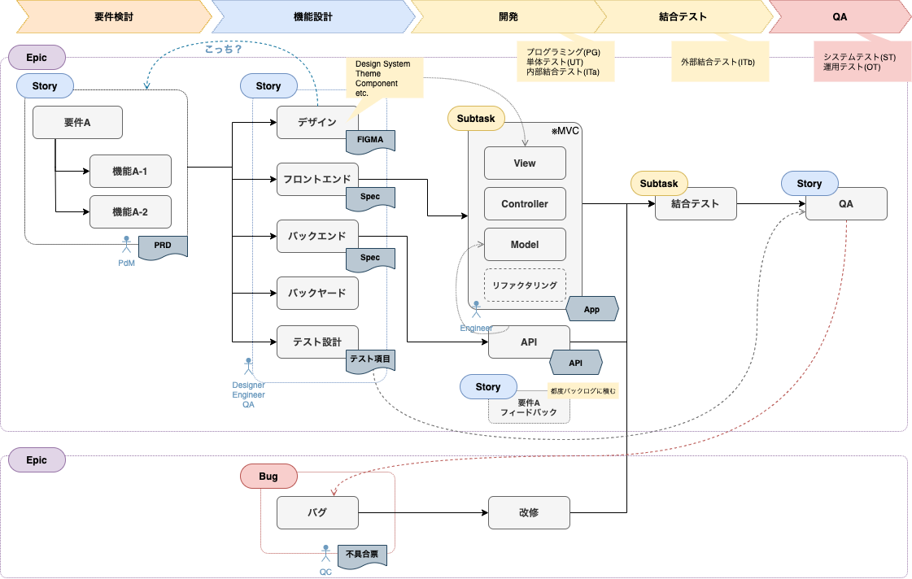
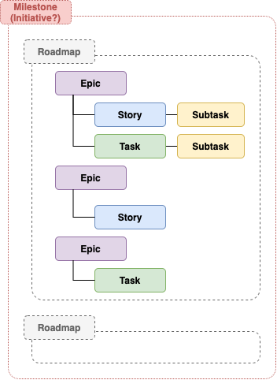
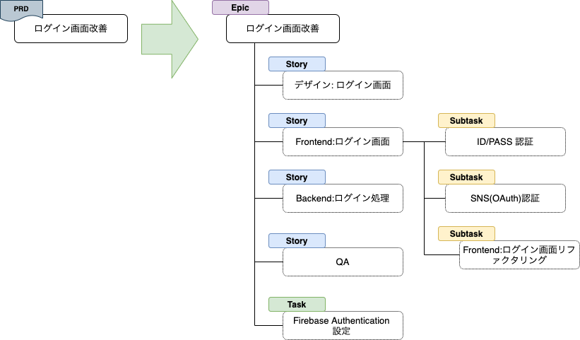
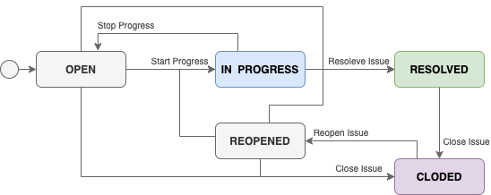
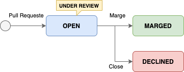

# JIRA を使用したアジャイルのチケットワークフロー

※ JIRA を使用して アジャイルプロジェクト運営時のチケット構成/ワークフローの考察

## Product Flow
### Flow and Issue Type

### Issue Type Hierarchy

### Issue Example

## Issue Status Workflow

### Issue Development Status

#### (参考)
- [プロダクトロードマップ | Atlassian](https://www.atlassian.com/ja/agile/product-management/product-roadmaps)
- [エピック、ストーリー、テーマ、そしてイニシアティブ | Atlassian](https://www.atlassian.com/ja/agile/project-management/epics-stories-themes)
- [課題のステータス、優先度、解決状況 \|Jira アプリケーション Cloud の管理 \| アトラシアン製品ドキュメント](https://ja.confluence.atlassian.com/adminjiracloud/issue-statuses-priorities-and-resolutions-973500867.html)
- [What are issue statuses, priorities, and resolutions? \| Atlassian Support](https://support.atlassian.com/jira-cloud-administration/docs/what-are-issue-statuses-priorities-and-resolutions/)
- [Viewing the development information for an issue | Jira Software Cloud | Atlassian Documentation](https://ja.confluence.atlassian.com/jirasoftwarecloud/viewing-the-development-information-for-an-issue-777002795.html)
- [View development information for an issue | Jira Software Cloud | Atlassian Support](https://support.atlassian.com/jira-software-cloud/docs/view-development-information-for-an-issue/)
